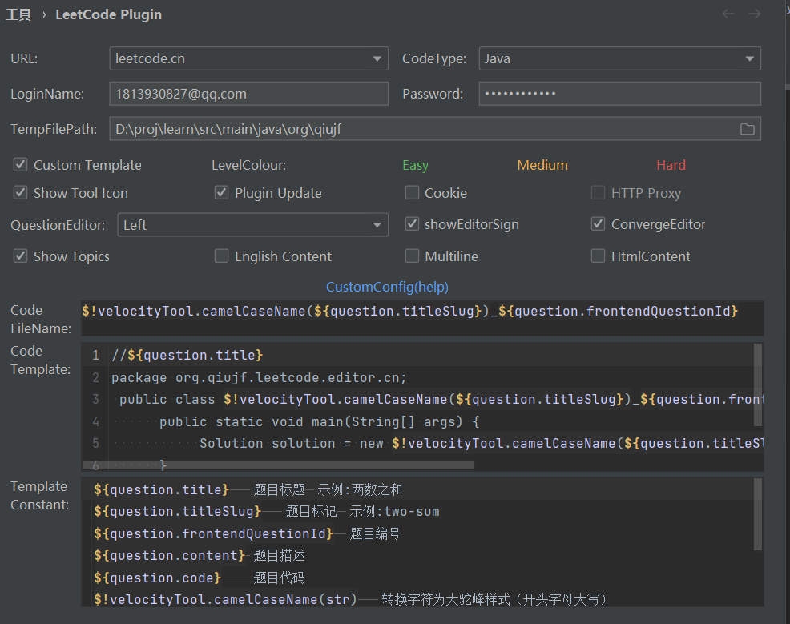

```code 
$!velocityTool.camelCaseName(${question.titleSlug})_${question.frontendQuestionId}
```
```shell
//${question.title}
package org.qiujf.leetcode.editor.cn;
 public class $!velocityTool.camelCaseName(${question.titleSlug})_${question.frontendQuestionId}{
      public static void main(String[] args) {
           Solution solution = new $!velocityTool.camelCaseName(${question.titleSlug})_${question.frontendQuestionId}().new Solution();
      }
      ${question.code}
  }
```

